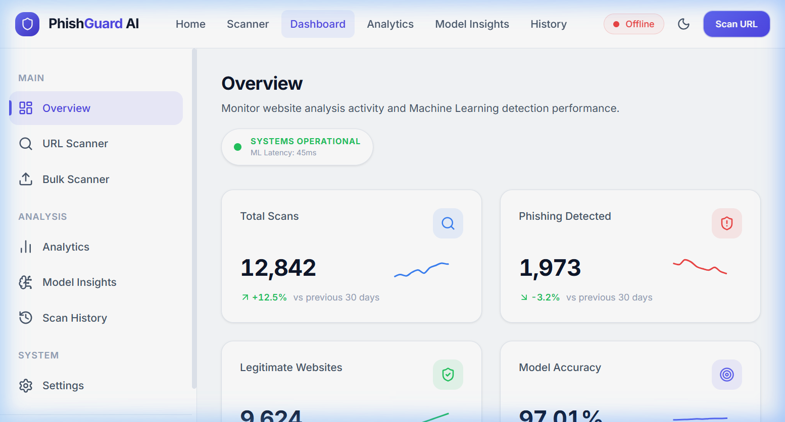
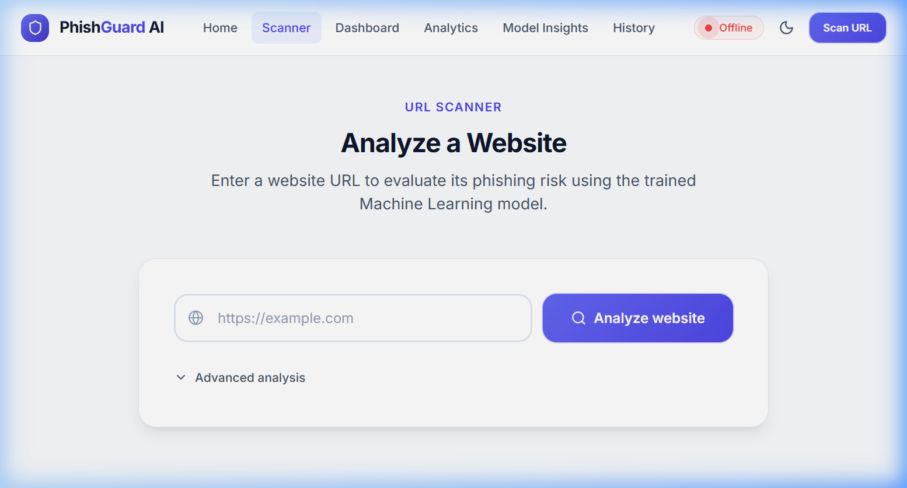
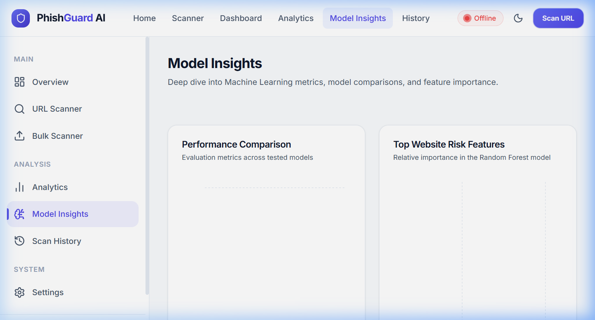
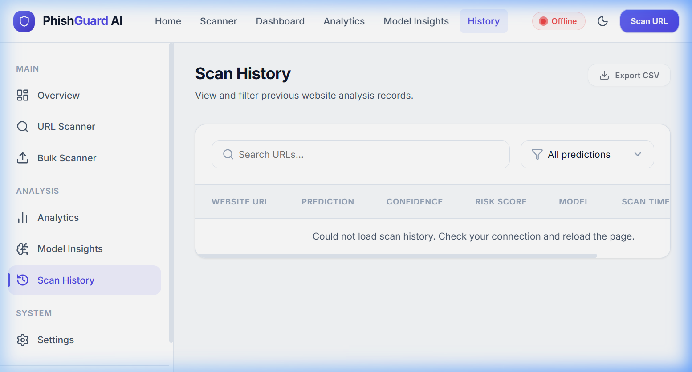

# PhishGuard AI — Phishing Website Detection System

[](https://vitejs.dev/)
[](https://react.dev/)
[](https://flask.palletsprojects.com/)
[](https://scikit-learn.org/)

PhishGuard AI is an advanced, machine-learning-powered web application designed to analyze and detect phishing websites in real-time. By extracting 111 distinct features from a URL (ranging from lexical properties to live DNS/TLS metrics) and feeding them into a trained Random Forest model, the system provides high-confidence risk assessments to protect users from malicious sites.

> **Developed by Yash Gajera**

---

## 📸 Screenshots

| Dashboard Overview | Real-Time URL Scanner |
|:---:|:---:|
|  |  |
| **Model Insights & Metrics** | **Scan History & CSV Export** |
|  |  |

---

## ✨ Key Features

- **Real-Time URL Scanning:** Analyzes URLs on-demand, providing a binary verdict (Phishing/Legitimate) alongside a detailed risk score and confidence probability.
- **Bulk Scanning:** Upload a TXT file of URLs to scan multiple domains concurrently (up to 200 URLs, multi-threaded).
- **Comprehensive Feature Extraction:** Extracts 111 data points per URL, including lexical analysis (lengths, special characters), DNS records, TLS certificates, and HTTP response metrics.
- **Explainable AI:** Breaks down the risk score by showing the specific features that contributed most heavily to the prediction (e.g., unusual `time_domain_activation` or missing `tls_ssl_certificate`).
- **Data Export & Reporting:** Download detailed PDF reports for individual scans, or export your entire scan history as a CSV file.
- **Beautiful, Responsive UI:** A premium, fully responsive interface featuring a bespoke design system, smooth micro-animations, and interactive charts (via Recharts).

## 🛠 Technology Stack

### Frontend
- **Framework:** React 18 + Vite
- **Styling:** Custom CSS (Design System with Variables)
- **Icons & Visualization:** Lucide React, Recharts, Framer Motion
- **Export Capabilities:** html2canvas, jspdf

### Backend & ML
- **Framework:** Python + Flask
- **Machine Learning:** Scikit-Learn (Random Forest Classifier)
- **Data Processing:** Pandas, NumPy
- **Feature Extraction:** Custom live extraction scripts covering Lexical, DNS, WHOIS, and HTTP vectors.

---

## 🚀 Getting Started

### Prerequisites
- Node.js (v18+)
- Python (3.9+)

### 1. Set up the Backend (Flask API)

The backend serves the pre-trained `phishing_rf_model.pkl` and performs live feature extraction.

```bash
# Navigate to the backend directory
cd backend

# Create and activate a virtual environment
python -m venv .venv
.venv\Scripts\activate   # Windows
# source .venv/bin/activate  # macOS/Linux

# Install dependencies
pip install -r requirements.txt

# Start the Flask server (runs on http://localhost:5000)
python app.py
```

To verify the backend is running, check the health endpoint: `curl http://localhost:5000/health`

### 2. Set up the Frontend (React App)

```bash
# Navigate to the frontend directory
cd Designing

# Install dependencies
npm install

# Start the Vite development server
npm run dev
```

The application will be available at `http://localhost:5173`. 
*(Note: Ensure your `.env` file in the `Designing` folder contains `VITE_API_URL=http://localhost:5000` and `VITE_USE_MOCK=false` to connect to the live backend).*

---

## 🧠 How the Model Works

The application uses a **Random Forest Classifier** trained on a dataset of legitimate and phishing URLs.

1. **Input:** The user submits a URL via the frontend.
2. **Extraction:** The backend's `features.py` script attempts to extract 111 distinct features. ~98 are lexical (extracted immediately from the string), and ~13 require live network lookups (DNS, WHOIS, TLS, ASN).
3. **Scaling:** The features are normalized using a pre-fitted `StandardScaler` (`models/phishing_scaler.pkl`).
4. **Prediction:** The model returns a probability score `P(phishing)`.
   - `P >= 0.75` → Phishing
   - `P <= 0.35` → Legitimate
   - Otherwise → Suspicious

*Note: Live network lookups are subject to a timeout (`LOOKUP_TIMEOUT`) to ensure the scanner remains responsive. If a lookup fails, the feature gracefully degrades to a neutral value.*

---

## 📄 License
This project was developed by Yash Gajera.
